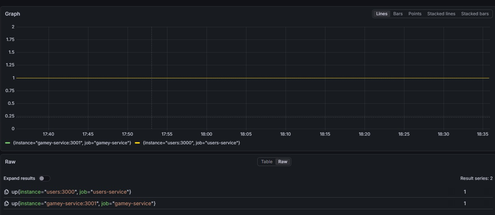

[[section-quality-scenarios]]
== Quality Requirements

=== Quality Tree

The following quality tree summarizes the most important quality goals and links them to the concrete scenarios described in the next section.
Higher-priority goals are listed first.

[cols="1,2,2", options="header"]
|===
|Quality Category |Sub-quality |Related Scenario(s)
|**Security** |Authentication, data protection |QS-01, QS-02
|**Performance** |Response time, throughput |QS-03, QS-04
|**Usability** |Learnability, feedback clarity |QS-05, QS-06
|**Reliability** |Availability, fault tolerance |QS-07, QS-08
|**Maintainability** |Modifiability, testability |QS-09, QS-10, QS-11
|===

=== Quality Scenarios

==== QS-01: Unauthorized users cannot access protected resources

[cols="1,3"]
|===
|Source |Unauthenticated or malicious external actor
|Stimulus |Attempt to access player data or game state via the API without a valid JWT token
|Environment |Any environment, including production
|Artifact |API authentication layer in the User Service and GameY API Gateway
|Response |The request is rejected with HTTP 401 or 403
|Response Measure |Zero successful unauthorized accesses to protected endpoints, verified by unit and integration tests covering JWT validation and CORS origin filtering
|===

_Evidence: Section 12.1 confirms the authentication lifecycle is tested, covering JWT issuance, bcrypt hashing, and strict CORS origin filtering._

==== QS-02: Passwords and sensitive data are stored securely

[cols="1,3"]
|===
|Source |Developer or database administrator inspecting the database
|Stimulus |Inspection of stored user credentials in MongoDB
|Environment |Any environment where user accounts exist
|Artifact |User Service persistence layer
|Response |No plaintext passwords or sensitive tokens are found in storage
|Response Measure |All passwords are hashed with bcrypt (cost factor 10); no plaintext credentials exist in any collection or log, verified by automated tests
|===

_Evidence: Section 12.1 explicitly tests bcrypt password hashing and confirms no plaintext storage._

==== QS-03: System handles peak concurrent load

[cols="1,3"]
|===
|Source |Multiple players starting game sessions simultaneously
|Stimulus |Up to 150 concurrent users interacting with the application across signup and game move flows
|Environment |Peak usage period, tested against the deployed Azure environment
|Artifact |User Service, GameY API Gateway, and Rust Engine
|Response |All requests are processed without errors; no board state is lost or corrupted
|Response Measure |Error rate stays at 0% (0 KO responses); p95 response time stays below 2 seconds, validated by Gatling load tests ramping from 0 to 15 rps across 7 progressive phases
|===

_Evidence: Section 12.4 describes Gatling load tests with 0 KO results. The updated injection profile ramps up to 15 rps sustained, reaching approximately 100-150 concurrent users at peak._

==== QS-04: Board updates are reflected within acceptable response time

[cols="1,3"]
|===
|Source |Player submitting a move during a game session against the AI
|Stimulus |A player places a tile; the move is sent to the GameY API Gateway, forwarded to the Rust Engine, and the updated state is returned
|Environment |System under normal load, Player-vs-AI mode
|Artifact |GameY API Gateway and Rust Engine
|Response |The updated board state is returned to the frontend and rendered
|Response Measure |Response time for move validation and AI calculation stays below 2 seconds in 95% of cases, consistent with load test results from Section 12.4
|===

_Note: Real-time push (WebSockets) is not yet implemented. This scenario covers the current REST-based flow only. The Human vs Human multiplayer real-time scenario is tracked as a technical debt in Section 11._

==== QS-05: New user can start a game without prior instructions

[cols="1,3"]
|===
|Source |First-time user with no prior knowledge of the system
|Stimulus |User opens the application and attempts to register, start a game, and place their first tile
|Environment |Standard browser, no tutorial shown beforehand
|Artifact |Frontend UI and onboarding flow
|Response |The user completes registration, finds the game lobby, and successfully places their first tile
|Response Measure |At least 80% of test users place their first tile within 3 minutes without external help, validated by usability testing
|===

_Evidence: Section 12.3 usability tests show all 5 participants completed the full task flow. The reference user (CK=10) completed in 73 seconds; average completion was approximately 133 seconds, well within the 3-minute threshold._

==== QS-06: Player receives clear feedback when a tile placement is invalid

[cols="1,3"]
|===
|Source |Player during an active game session
|Stimulus |Player attempts to place a tile on an already occupied cell
|Environment |Normal gameplay, Player-vs-AI mode
|Artifact |Frontend validation layer and GameY Engine error propagation
|Response |The invalid placement is visually indicated; no raw error message or silent failure occurs
|Response Measure |Feedback is shown within 200 milliseconds of the attempt; verified by E2E tests covering the invalid move scenario (Section 6.5)
|===

_Evidence: Section 12.1 and 12.2 confirm error handling is tested end-to-end, including the Rust engine returning 400 Bad Request and the frontend rendering appropriate feedback._

==== QS-07: Application is available during expected usage hours

[cols="1,3"]
|===
|Source |End users accessing the system at any time
|Stimulus |User attempts to access the application
|Environment |Non-maintenance period, standard operating conditions on the Azure VM
|Artifact |Deployment infrastructure, Docker Compose orchestration, and Prometheus/Grafana monitoring stack
|Response |The application loads and is fully functional
|Response Measure |System availability is at least 99% measured monthly, excluding scheduled maintenance windows; monitored continuously via Prometheus and visualized in Grafana dashboards.
|===

Currently, our Grafana states that both of our services have always been available:

==== QS-08: System recovers gracefully from database connectivity issues

[cols="1,3"]
|===
|Source |Infrastructure failure or transient network issue
|Stimulus |MongoDB becomes temporarily unreachable during active user requests
|Environment |Production environment, any load level
|Artifact |User Service Health Guard middleware
|Response |The system handles the disconnection gracefully without crashing; retries are attempted automatically and the user receives an appropriate error response
|Response Measure |No unhandled crashes occur on MongoNotConnectedError; automatic retry logic is triggered, verified by unit tests covering the Health Guard middleware
|===

_Evidence: Section 12.1 explicitly tests the Health Guard middleware for database disconnects and MongoNotConnectedError retry logic._

==== QS-09: A developer can add a new AI strategy with limited effort

[cols="1,3"]
|===
|Source |Developer extending the system
|Stimulus |A new AI move-generation strategy needs to be added to the GameY Engine
|Environment |Development environment, working codebase
|Artifact |Rust bot module and YBotRegistry
|Response |The new strategy is available for selection via the API and UI without modifying other subsystems
|Response Measure |The change requires modifications in no more than 3 files within the bot module and can be completed in under 2 hours by a developer familiar with the codebase
|===

==== QS-10: The test suite covers critical game logic

[cols="1,3"]
|===
|Source |Development team running the CI pipeline
|Stimulus |A pull request is submitted with changes to board or move validation logic
|Environment |Automated CI environment with GitHub Actions
|Artifact |Unit and integration test suite across Rust, Node.js, and React
|Response |The pipeline runs all relevant tests and reports pass or fail clearly
|Response Measure |Code coverage for core game logic modules is at least 80%; the CI pipeline completes within acceptable time, enforced by SonarCloud quality gates on every pull request
|===

_Evidence: Section 12.1 confirms >80% coverage is maintained across critical paths including move validation, session security, and database connectivity._

==== QS-11: The application supports multiple languages without code changes

[cols="1,3"]
|===
|Source |Developer adding a new locale or translator updating existing strings
|Stimulus |A new language file is added or an existing translation key is updated
|Environment |Development environment
|Artifact |React frontend and react-i18next locale JSON files
|Response |The new or updated language is reflected across all user-facing strings without modifying any React component code
|Response Measure |All user-facing strings are managed exclusively through locale JSON files; English fallback is applied automatically for missing keys; verified by localization integration tests
|===

_Evidence: Section 12.1 confirms react-i18next integration is tested, including multilingual support and translation key resolution._